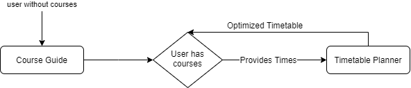

# Timetable Planner

A web app that helps UofT students plan their courses to generate their optimal timetable. 

The timetable planner allows students to enter their course load and get back a timetable that fits their needs. The vision for the timetable planner includes taking student preferences into account such as: 

- How early students wish to start and end classes
- What days students would like to take off
- What times students would prefer gap time and breaks


## Overview



## Example Usage:

### Future Implementation:

Given a set of course codes, the timetable planner outputs the schedule available for the set.

If no such schedule available, outputs "inValid".

//Setting up preference are still work in progress

#### Input:

```json
#provided two courses with two section for simplicity
{
    "CourseCode": {
        "CSC108H5F2019":{
            "L0101":[{
                "MONDAY":[32400, 36000],
                "WEDNESDAY":[32400, 36000],
                "FRIDAY":[32400, 36000],
                "size":160,
                "enrolment":0

            }],
            "L0107":[{
                "WEDNESDAY":[64800, 75600],
                "size":160,
                "enrolment":0
                }]
        },
        "CSC318H5F2019":{
            "L0101":[{
                "TUESDAY":[68400, 75600],
                "WEDNESDAY":[68400, 75600],
                "size": 60,
                "enrolment": 0
            }],
            "T0107":[{
                "THURSDAY":[68400, 75600],
                "size": 60,
                "enrolment": 0
                }]
        },
        
}

```

#### Output:

```json

{
    "MONDAY":[
        {
            "CSC108H5F2019L0101":[32400, 36000]
        }
        ],
    "TUESDAY":[
        {
            "CSC318H5F2019L0101":[68400, 75600]
        }
        ],
    "WEDNESDAY":[
        {
            "CSC108H5F2019L0101":[32400, 36000]
        },
        {
            "CSC318H5F2019L0101":[68400, 75600]
        }
        ],
    "THURSDAY":[
        {
            "CSC318H5F2019T0101":[68400, 75600]
        }
        ],
    "FRIDAY":[
        {
            "CSC108H5F2019L0101":[32400, 36000]
        }
        ],
}

```

## Current Implementateion
### (WIP)

Given a set of times, check if there is a valid timetable avaliable.

Outputs "Valid" if such timetable exist, or else "inValid".

#### Input:

```json
#provided one set of time to check if a valid timetable exist
{
    "CourseCode": {
        "CSC108H5F2019":{
            "L0101":[{
                "MONDAY":[32400, 36000],
                "WEDNESDAY":[32400, 36000],
                "FRIDAY":[32400, 36000],
                "size":160,
                "enrolment":0

            }],
        },
        "CSC318H5F2019":{
            "L0101":[{
                "TUESDAY":[68400, 75600],
                "WEDNESDAY":[68400, 75600],
                "size": 60,
                "enrolment": 0
            }],
        },
        
}
```

#### Output:

```json
"Valid"
```
### or

#### Input:

```json
#provided one set of time to check if a valid timetable exist
{
    "CourseCode": {
        "CSC108H5F2019":{
            "L0107":[{
                "WEDNESDAY":[64800, 75600],
                "size":160,
                "enrolment":0
                }]
        },
        "CSC318H5F2019":{
            "L0101":[{
                "TUESDAY":[68400, 75600],
                "WEDNESDAY":[68400, 75600],
                "size": 60,
                "enrolment": 0
            }],
        },
        
}

```

#### Output:

```json

"inValid"

```
